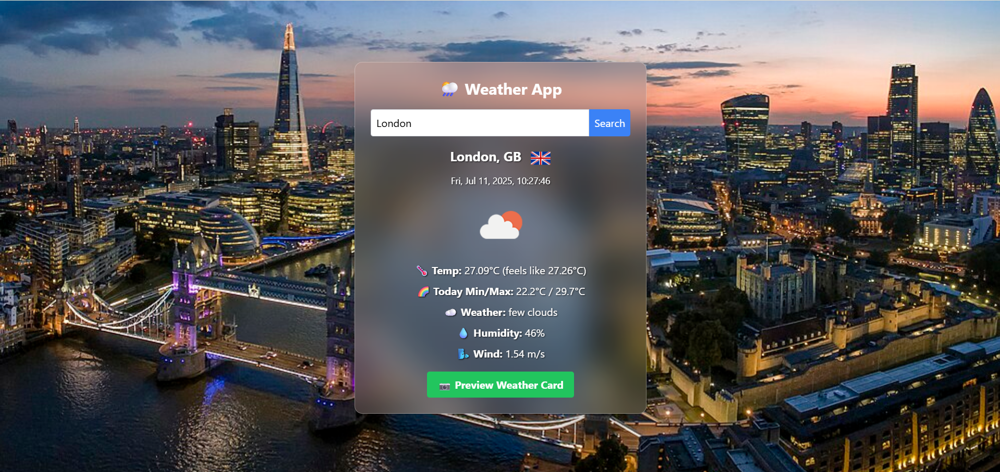

# 🌦️ Weather App

A beginner-friendly weather application that displays real-time weather data and generates shareable weather cards with city landmark backgrounds. Built using **JavaScript**, **Tailwind CSS**, and open APIs.

---

## 🚀 Live Demo

🌐 [View Live App](https://arkaparno.github.io/weather-app)

---

## 📸 Preview



---

## ✨ Features

- 📍 Get weather by city name or your current location
- 🌤️ Shows temperature, min/max, humidity, wind, and weather description
- 🖼️ Auto-fetches city background from Wikipedia
- 📝 Local date and time using TimeZoneDB API
- 📷 Generate and download/share a visual weather card
- 🎨 Smooth and responsive UI with TailwindCSS

---

## ⚙️ Technologies Used

- **HTML5**
- **Vanilla JavaScript**
- **Tailwind CSS**
- **OpenWeatherMap API**
- **TimeZoneDB API**
- **Wikipedia API**
- **html2canvas**

---

## 🛠️ Setup & Usage

1. Clone the repository:
   ```bash
   git clone https://github.com/arkaparno/weather-app.git
   cd weather-app

2. Replace the texts in api key variables with your actual key

---

# weather-app
A weather application that shows real-time weather and generates shareable cards
